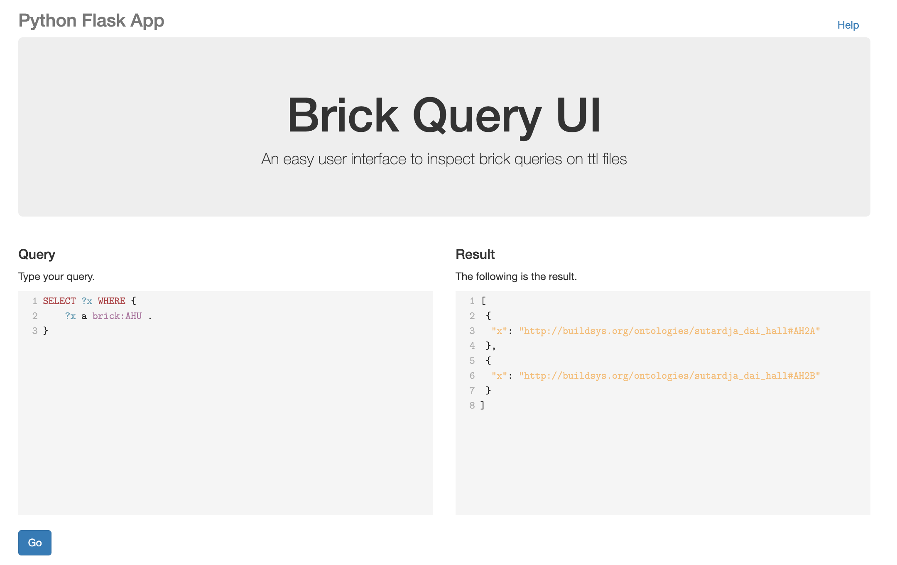

# Brick Query UI

This repository contains a [Flask]() application used to perform interactive queries on a [Brick]() ontology semantic model. The
objective is to provide a quick and easy way to write validate and perform queries.



## Local deployment

Install required packages from the requirement file.

```bash
pip install -r requirements.txt
```

Run flask application with the following command:

```bash
flask run
```

You should see something like this:

```bash
* Environment: production
* Debug mode: off
* Running on http://127.0.0.1:5000/ (Press CTRL+C to quit)
```

Now visit [`http://127.0.0.1:5000/`](http://127.0.0.1:5000/) to access the flask application.

## Docker deployment

Execute the following commands to create the Docker network, build a container and run the resulting image:

```bash
export $(grep -v '^#' .env | xargs)
# create a network
docker network create brick-query-app-network
# build container uncomment if already built
docker image build -t brick-query-app .
# starts app database on localhost
docker run -d --net brick-query-app-network --name brick-query-app -p 127.0.0.1:5000:5000 brick-query-app
```

Once the script finishes running, use the following command to list all running containers:

```bash
docker ps
```

When you finish close the containers and delete te network with the following commands
```bash
docker stop brick-query-app
docker rm brick-query-app
docker network rm brick-query-app-network
```

## Notes

Distributed under MIT License and built with

* [Flask](https://flask.palletsprojects.com/en/2.2.x/)
* [Brick](https://brickschema.org/)
* [Bootstrap](https://getbootstrap.com/)
* [CodeMirror](https://codemirror.net/)
